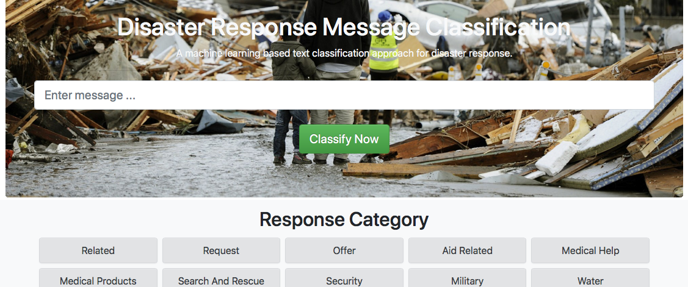
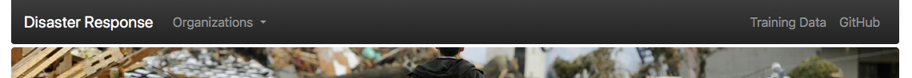
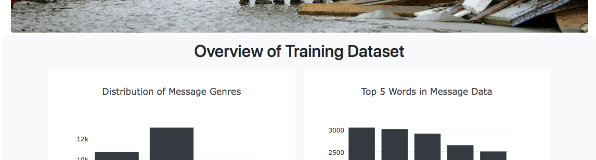

# Disaster Response
Exploring ETL and ML pipelines for text classification.

## Intro
Whenever natural disaster occur it's important to deliver aid and assistance to those who need it the most. Knowing quickly where the ones affected are and what they require can be key for disaster response teams in order to save human lifes. But how to find the right information out of an endless amount of messages such as on the internet or the news?

This project tries to explore how __machine learning__ can help organizations to make __better aid and assistance related decisions__, especially during and after natural disasters.

## Installation
Despite standard libraries that come with the Anaconda distribution of Python 3 you'll need ```sklearn```, ```nltk``` and ```sqlalchemy``` for both model training and web app deployment. Also, you'll need ```flask``` and ```plotly``` in order to successfully run the app. For further information on packages and versions please see the ```requirements.txt``` file in the repository.

## Files
Files within this repository a separated into __three main groups__, namely:
- ```app``` includes all files related to the web app's backend and frontend architecture
- ```data``` includes all files related to the data used in the project
- ```models``` includes all files related to model training as well as the trained model

Despite that you can use __the following tree for orientation__ and additional explanation of files:
```
- app
| - template
| |- master.html            # Main page of web app
| |- go.html                # Classification result page of web app
|- run.py                   # Flask file that runs app

- data
|- disaster_categories.csv  # Data to process 
|- disaster_messages.csv    # Data to process
|- process_data.py          # Data pre-processing
|- disaster_response.db     # Database to save pre-processed data to

- img
|- classification.png       # Screenshot of classification feature
|- navigation.png           # Screenshot of navigation bar
|- training_data.png        # Screenshot of overview of training data

- models
|- train_classifier.py      # Model training
|- classifier.pkl           # Saved model
|- custom_transformer.py    # Custom transformer for sklearn pipeline

- README.md
- requirements.txt
```

## Usage
Eventhough this repository comes with all files needed to run the trained text classification model in a web app already, you're free to choose if you want to train a new model on the existing or a new message data set. Should you only be interested in deploying the web app for your purposes you can jump straight ahead to [Flask Web App](https://github.com/pape1412/disaster_response#flask-web-app).

### ETL Pipeline
#### Data
The data that's being used in this project comes from __two disaster messages data sets__ provided by [Figure Eight](https://www.figure-eight.com). Both of these data sets require additional pre-procsessing steps in order to be used for training a model. After pre-processing, the data set contains __26,028 different messages__ across __35 different disaster reponse categories__ (one category was removed due to zero variance).

#### Pre-Processing
The pre-processing is/was done within a __small ETL (Extract, Transform, Load) pipeline__. Should you wish to re-run these pre-processing steps with a new or the existing data set you can do so by __executing the following line__ from the __main folder__:
```
$ python3 data/process_data.py data/disaster_messages.csv data/disaster_categories.csv data/disaster_response.db
```
The command takes __three positional arguments__, namely both the paths to the messages and categories data sets as well as the path to a new SQLite database.

The underlying ETL pipeline __loads__ the ```disaster_messages.csv``` and ```disaster_categories.csv``` data sets, __merges__ them together, __cleans__ the data (e.g. creation of category labels, removal of duplicates, ...) and then __stores__ a new data set at the given path in a SQLite database.

### ML Pipeline
#### Training
The machine learning pipeline includes all steps necessary to successfully train a __multi-label disaster response classification model__. Eventhough you find a trained classification model under the ```models``` folder, you may also choose to (re-)train your own model by running the following command from the main folder:
```
$ python3 models/train_classifier.py data/disaster_response.db models/classifier.pkl
```
The ```train_classifier.py``` file takes the path to a SQLite database which stores the pre-processed disaster messages data as well the path to save the trained model to as __two positional arguments__.

After loading the pre-processed data set from the SQLite database, it splits the data and sets up a text processing and machine learning pipeline with sklearn's ```Pipeline```, ```FeatureUnion``` and ```MultiOutputClassifier``` modules. It then runs a __randomized grid search with cross-validation__ of a medium sized parameter space for 10 iterations (trains only 10 different models instead of running a full search over the cartesian grid of parameters). Last but not least the pipeline finishes with an output of __model evaluation metrics__ and then __saves the best performing model__ to a ```.pkl``` file.

#### Evaluation
Once the training process has finished you'll see an output of the models per class classification performance including __precision, recall and f1 score__. Choosing those measures over __accuracy__ is important as the data set used in this project suffers class imbalance across many of the message categories. Apart from that there are other reasons why focussing on those metrics is important:
- For organizations it remains crucial to identify those __messages that are actually related to a disaster__, so they don't in focus their work on anything unrelated (precision).
- At the same time they want to capture __as many important messages as possible__, so everyone in need gets aid an assistance (recall). 

### Flask Web App
If you're interested in seeing the trained disaster response classification model in action you can simply __run the web app__ in this repository by executing the following command from the __main folder__ and then visiting ```http://0.0.0.0:3001/``` in your local browser.
```
$ python3 app/run.py
```
The web app comes with one major functionality, namely the __classification of appropriate disaster response categories__ based on disaster messages. By entering a message and clicking "_Classify Now_" you will see related response categories lighting up in green.



The __navigation bar__ at the top of the app ...



... gives you additional options such as getting an __overview of the training data__, visiting this __GitHub repository__ or connecting to disaster response organizations.



At the moment the web app is built to __run locally or a remote server__, but you could easily extend this to work on a cloud platform e.g. [Heroku](https://www.heroku.com).

## Acknowledgements
I'd really like to thank [Figure Eight](https://www.figure-eight.com) for providing this data set. It's data sets like this one that give people the opportunity to work on data science and machine learning project with a true meaning and purpose.
__Please be aware__ that this data set was provided in [Udacity's Data Scientist Nanodegree Program](https://eu.udacity.com/course/data-scientist-nanodegree--nd025) so it may not be free for everyone to use.
